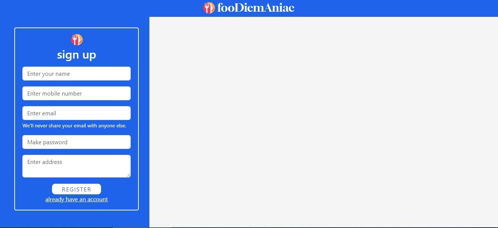
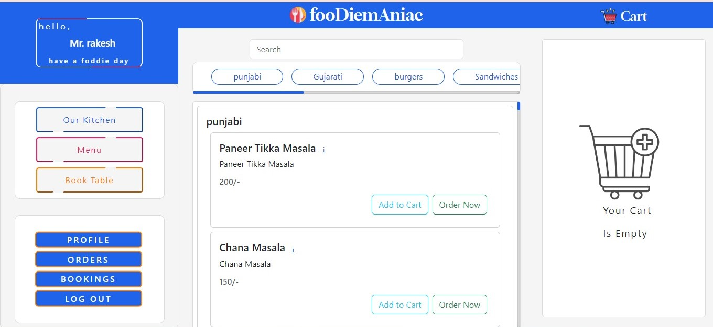
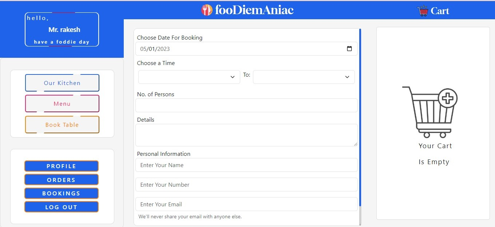
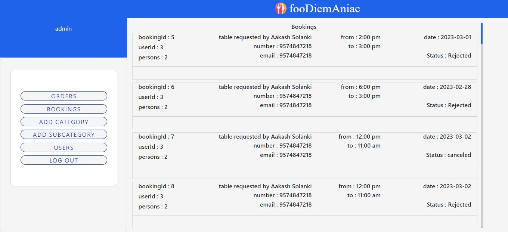
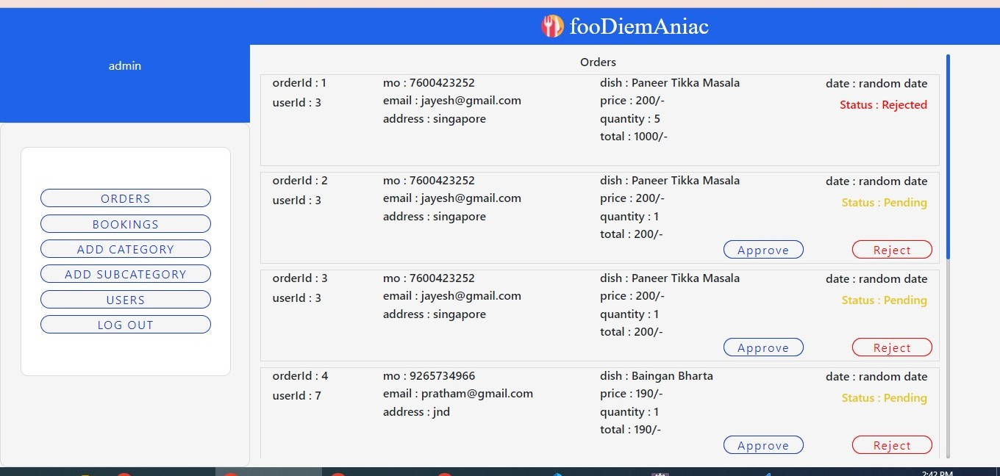

Restaurant
# Restaurant
# Restaurant

# project-documentation

  

<h3 align="center">Restaurant</h3>

---

      

## 📝 Table of Contents
- [About](#about)
- [Getting Started](#getting_started)
- [Deployment](#deployment)
- [Usage](#usage)
- [Flow Chart](#flowchart)
- [SnapShots](#Snapshots)
- [Authors](#authors)
- [Acknowledgments](#acknowledgement)

## 🧐 About 
A Java web project restaurant management system using HTML, CSS, Java, JSP, Servlet, and MySQL Workbench is a system designed to automate and streamline the restaurant's various processes. The system allows the restaurant to manage orders, inventory, staff and customers efficiently. 
The system will have a web-based user interface that will be accessible from any device with an internet connection.
The front-end of the system will be designed using HTML, CSS, and JSP. The back-end will be developed using Java and Servlet, and the database for the system will be created using MySQL Workbench.
The system will be user-friendly, and the interface will be intuitive, making it easy for the restaurant staff to use. The system will also provide various reports that will help the restaurant make informed decisions about its operations. The system will have a secure login system to ensure that only authorized personnel can access the system's features.
Overall, the system will provide an efficient way for the restaurant to manage its operations, reduce manual work, and increase productivity. The use of JSP and Servlets will make the system dynamic and enable real-time data processing, making it an excellent tool for the restaurant's operations

## 🏁 Getting Started 
These instructions will get you a copy of the project up and running on your local machine for development and testing purposes. See [deployment](#deployment) for notes on how to deploy the project on a live system.

### Prerequisites
What things you need to install the software and how to install them.

we have install 

1) Eclipse
2) apache tomcat server 9.0
3) MySql Workbench
4) java development kit(JDK) 1.8

### Installing
A step by step series of examples that tell you how to get a development env running.

## how to install Eclipse

1)To install Eclipse on your computer, follow these steps:

2)Go to the official Eclipse website (https://www.eclipse.org/downloads/).

3)Choose the version of Eclipse that you want to download. Eclipse offers different versions for different programming languages and development environments. Choose the version that best suits your needs.

4)Click on the download button next to the version that you want to download.

5)Save the downloaded file to your computer.
Once the download is complete, double-click on the downloaded file to start the installation process.

6)Follow the on-screen instructions to complete the installation process. During the installation, you may be prompted to choose an installation directory and specify any additional components that you want to install.

7)Once the installation is complete, you can launch Eclipse by double-clicking on the Eclipse icon on your desktop or in your installation directory.
That's it! Eclipse should now be installed on your computer and ready to use.

## how to install  apache tomcat server 9.0 in Eclipse

1)Download the latest version of Apache Tomcat Server 9.0 from the official Apache Tomcat website (https://tomcat.apache.org/download-90.cgi).

2)Extract the downloaded archive to a directory of your choice.

3)Open Eclipse and select "Window" -> "Preferences" from the menu bar.

4)In the Preferences window, expand the "Server" node and select "Runtime Environments".

5)Click the "Add" button to create a new server runtime environment.

6)In the "New Server Runtime Environment" window, select "Apache Tomcat v9.0" from the list of available server types, then click "Next".

7)In the "Tomcat installation directory" field, enter the path to the directory where you extracted the Apache Tomcat Server 9.0 archive in step 2.

8)Click "Finish" to create the new server runtime environment.

9)In the "Server" view, right-click and select "New" -> "Server" from the context menu.

10)In the "New Server" window, select the server type you just created in step 6 and click "Next".

11)In the "Server runtime environment" section, select the server runtime environment you just created in step 8 and click "Finish".

12)The Apache Tomcat Server 9.0 is now added to Eclipse.
That's it! You have successfully installed Apache Tomcat Server 9.0 in Eclipse. Now you can create and deploy your Java web applications on this server.

## how to install MySql Workbench

1)Go to the official MySQL website and download the MySQL Installer: https://dev.mysql.com/downloads/installer/

2)Run the installer and choose "Custom" installation.

3)In the "Select Products and Features" step, select "MySQL Workbench" and click "Next".

4)Choose "Standalone MySQL Server/Classic MySQL Replication" as the configuration type.

5)In the "Installation" step, choose the installation directory and click "Execute".

6)Once the installation is complete, click "Next" and then "Finish".

7)To start MySQL Workbench, go to the Windows Start menu and search for "MySQL Workbench". Click on the application to open it.
That's it! MySQL Workbench should now be installed on your Windows machine and ready to use. You can now use it to manage your MySQL databases.

## how to install java development kit(JDK) 1.8

1)Go to the Oracle JDK download page: https://www.oracle.com/java/technologies/javase/javase-jdk8-downloads.html

2)Accept the license agreement by clicking on the "Accept License Agreement" radio button.

3)Download the appropriate JDK installation file for your operating system. For Windows, you will want to download the "Windows x64" installer.

4)Once the download is complete, double-click on the downloaded file to start the installation process.

5)In the installation wizard, select "Next" to begin the installation process.

6)Choose the installation directory where you want to install JDK and click "Next".

7)Select the components you want to install, including the Java Development Kit (JDK), and click "Next".

8)Select the installation type and click "Next". It is recommended to choose the default option which is "Typical".

9)Choose whether to install Java updates automatically or not, and click "Next".

10)Click "Install" to start the installation process.

11)Wait for the installation to complete. Once it is finished, click "Close" to exit the installer.
To verify that JDK 1.8 has been installed correctly, open a command prompt and type "java -version". You should see a message that shows the version number of the installed JDK.
That's it! You have successfully installed JDK 1.8 on your Windows machine.

## 🔧 Running the tests 
## 🎈 Usage 

Add notes about how to use the system.

* process of run the project on your system are as follow :

To run an existing project with Tomcat server in Eclipse, follow these steps:

1)Make sure that you have Apache Tomcat Server installed and configured in Eclipse as mentioned in the previous answer.

2)Open Eclipse and switch to the Java EE perspective. You can do this by clicking on "Window" -> "Perspective" -> "Open Perspective" -> "Java EE".

3)In the "Project Explorer" view, locate the project you want to run.

4)Right-click on the project and select "Properties" from the context menu.

5)In the "Properties" window, select "Project Facets" from the left-hand menu.

6)In the "Project Facets" view, make sure that "Dynamic Web Module" is checked. If it is not checked, check it and click "Apply" and then "OK".

7)Right-click on the project again and select "Run As" -> "Run on Server" from the context menu.

8)In the "Run on Server" wizard, select the server you want to run the project on (in this case, Apache Tomcat Server 9.0) and click "Next".

9)In the "Add and Remove" dialog, add the project to the list of selected projects and click "Finish".

10)Eclipse will start the server and deploy the project on it. You should see the project running in your default web browser.

That's it! You have successfully run an existing project with Tomcat server in Eclipse.

* How to connect with a database in mysql workbench

1)Open MySQL Workbench and click on the "Database" menu.

2)Click on "Connect to Database" to open the "Setup New Connection" dialog box.

3)In the "Setup New Connection" dialog box, enter the following details:

.)Connection Name: A descriptive name for your connection.

.)Hostname: The hostname or IP address of the MySQL server you want to connect to.

.)Port: The port number that MySQL is running on (usually 3306).

.)Username: Your MySQL username.

.)Password: Your MySQL password.

.)Click on the "Test Connection" button to verify that the connection details are correct. If the connection is successful, you .)will see a message indicating that the connection was successful.

4)Click on the "OK" button to save the connection details and connect to the database.
Once you have successfully connected to the database, you can start working with it in MySQL Workbench. You can create and manage databases, tables, and data, and perform various other operations on the database using the various tools and features provided by MySQL Workbench.

## 🚀 Deployment 
For this thing we need a 1.8 jdk install in your system.

## here is the step to set 1.8 jdk in your system
To set the JDK version to 1.8 in Eclipse follow these steps:

1)Make sure that you have the JDK 1.8 installed on your system. You can download it from the official Oracle website.

2)Open Eclipse and go to "Window" -> "Preferences".

3)In the Preferences window, expand the "Java" folder and click on "Installed JREs".

4)Click on the "Add" button to add a new JRE.

5)In the "Add JRE" window, select "Standard VM" and click "Next".

6)In the "JRE Definition" window, enter a name for the JRE (e.g., "JDK 1.8") and select the installation directory of the JDK 1.8.

7)Click on "Finish" to add the new JRE.

8)Select the newly added JRE in the "Installed JREs" window and click on the "Edit" button.

9)In the "Edit JRE" window, click on the "Add External JARs" button and navigate to the "lib" directory of the JDK 1.8 installation.

10)Select all the JAR files in the "lib" directory and click on "Open".

11)Click on "Finish" to save the changes.

12)Click on "OK" to close the Preferences window.
That's it! You have successfully set the JDK version to 1.8 in Eclipse. Now you can create new projects and run existing ones using JDK 1.8.

## ⛏️ Flow Chart 

- [HTML,CSS] - Front-end
- [Java,jsp,servlet] - Back-end
- [MySql](https://www.mysql.com/) - Database
- [Tomcat](https://tomcat.apache.org/) - localhost Server 

## Snapshots 

  

  

  

  

  

  

## ✍️ Authors 
this project develped in a group of two person:-

1)shivani kashyap
Link:- https://github.com/shivanikashyap1032

2)prit shah
Link:- https://github.com/prit2810

## 🎉 Acknowledgements 
- Hat tip to anyone whose code was used

1)As an student, I do not copy code from specific individuals or sources. Instead, I generate responses based on the algorithms and models trained on a vast corpus of data. However, it is always good practice to acknowledge the work of others if you have used their code or ideas in your own work. This helps to give credit where it's due and to avoid plagiarism. So, if you have used someone else's code, it is important to cite the source and give proper attribution.

- Inspiration

1)Online Ordering System: You could build a web application that allows customers to order food online from the restaurant. The application could use servlets and JSPs to manage the ordering process, from selecting items from the menu to entering payment information.
also you save your time insted of going hotel and book a table.

- References

1)Restaurant Management System using Java - This is a GitHub repository containing the source code for a restaurant management system using Java. It covers topics such as customer ordering, inventory management, and billing. 
Link: https://github.com/madhavipatil6/Restaurant-Management-System-using-Java

2)Restaurant Management System using JSP and Servlets - This is a GitHub repository that contains the source code for a restaurant management system using JSP and Servlets. It covers topics such as menu management, order processing, and billing. Link: https://github.com/sumitmukherjee13/Restaurant-Management-System-using-JSP-and-Servlets

3)Online Food Ordering System using JSP and Servlets - This is a GitHub repository that contains the source code for an online food ordering system using JSP and Servlets. It covers topics such as customer registration, menu management, and order processing. 
Link: https://github.com/siddharthx/Online-Food-Ordering-System-using-JSP-and-Servlets

4)"Web-based restaurant management system using JSP and Servlets" by Ramesh et al. - This research paper presents a web-based restaurant management system that is built using JSP and Servlets. The system covers various features such as menu management, order processing, billing, and customer feedback. 
Link: https://www.researchgate.net/publication/282675147_Web-based_Restaurant_Management_System_using_JSP_and_Servlets

5)"Web-based restaurant management system using JSP, Servlets, and MySQL" by Shakir et al. - This research paper presents a web-based restaurant management system using JSP, Servlets, and MySQL. The system includes features such as menu management, order processing, billing, and reporting. 
Link: https://www.researchgate.net/publication/319432131_Web-Based_Restaurant_Management_System_Using_JSP_Servlets_and_MySQL
